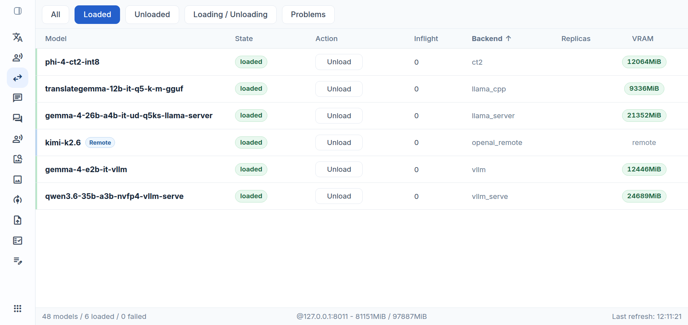
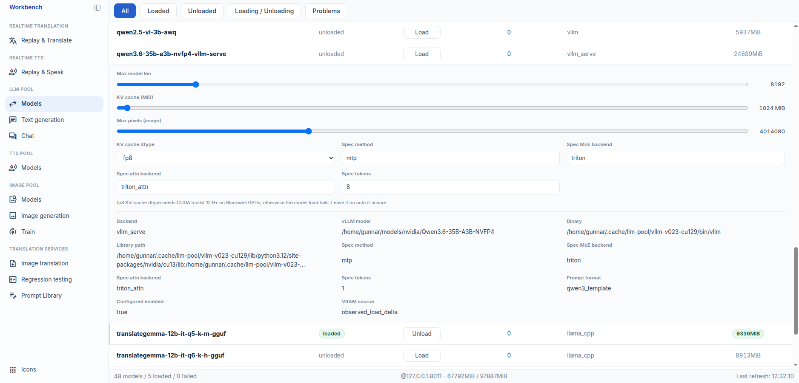

# llm-pool

FastAPI service that exposes a single `POST /v1/responses` API across local and remote LLM backends. It provides runtime model loading, unloading, queueing, replica routing, multimodal input, timing metrics, and an admin surface for model state, load/unload, runtime load overrides, and GPU memory estimates, used by a workbench UI.



*Loaded models in the Workbench.*

## Index

**Overview**

- [What It Does](#what-it-does)
- [Repository Role](#repository-role)
- [Related Repositories](#related-repositories)
- [Code Map](#code-map)

**Using the API**

- [API Surface](#api-surface)
- [Inference Example](#inference-example)
- [Request Fields](#request-fields)
- [Multimodal Input](#multimodal-input)
- [Multi-turn Conversations](#multi-turn-conversations)

**Runtime & Backends**

- [Runtime Model](#runtime-model)
- [Configuration](#configuration)
- [In-process Backends](#in-process-backends) — CT2, ExLlamaV3, llama_cpp, vLLM
- [Pool-managed Backends](#pool-managed-backends) — llama_server, vllm_serve
- [Remote Backends](#remote-backends) — openai_remote
- [Replicas](#replicas)

**Performance & Operations**

- [Timing Metrics](#timing-metrics)
- [Local Benchmark Snapshot](#local-benchmark-snapshot)
- [Development](#development)
- [Tests](#tests)
- [Deployment Notes](#deployment-notes)

**Reference**

- [Design Notes](#design-notes)
- [Acknowledgments](#acknowledgments)
- [License](#license)

## What It Does

- exposes one inference API for multiple model runtimes
- supports local CT2, ExLlamaV3, `llama_cpp`/GGUF, managed native `llama-server`, in-process vLLM, and managed `vllm serve` backends
- supports OpenAI-compatible remote Chat Completions backends behind an explicit `allow_remote` request gate
- accepts text input everywhere, and image input on backends/models that advertise image support
- supports single-turn `input` requests and backend-dependent multi-turn `messages` requests
- returns JSON responses or service-side SSE events from the same endpoint
- includes per-request timing and token metrics when the selected backend can report them
- exposes admin endpoints for model state, load/unload, runtime load overrides, and GPU memory estimates
- routes requests through an in-process scheduler with per-model queues, loaded runtime state, and optional identical replicas

## Repository Role

`llm-pool` is the model runtime service. It owns:

- the public LLM HTTP API
- runtime configuration loading from `settings.json` plus optional local overrides
- backend adapters
- model load/unload lifecycle
- scheduler and replica routing
- admin metadata used by UI clients

It does not own browser workflows, image generation, TTS, ASR, or persistent model-definition editing. Those are handled by sibling services or clients.

## Related Repositories

- `llm-workbench`: browser UI that calls the public and admin APIs.
- `image-pool`: image generation service.
- `tts-pool`: text-to-speech service.
- `asr-pool`: speech-to-text service.

The names above describe the local project family. This repo should remain usable without importing those projects.

## Code Map

| Path | Role |
| --- | --- |
| `app/main.py` | FastAPI app factory and HTTP endpoints. |
| `app/schemas.py` | Request, response, admin, metrics, and capability schemas. |
| `app/config.py` | Settings model, JSON loading, local override merge, and config coercion. |
| `app/engine/router.py` | Runtime registry, load/unload orchestration, scheduler integration, admin payloads. |
| `app/engine/scheduler.py` | Per-model queue and target-inflight scheduling. |
| `app/engine/common.py` | Shared backend metadata, capability helpers, stop strings, GPU memory helpers. |
| `app/engine/ct2.py` | CTranslate2 runtime adapter. |
| `app/engine/exllamav3.py` | ExLlamaV3 runtime adapter. |
| `app/engine/llama_cpp.py` | In-process llama.cpp GGUF adapter. |
| `app/engine/llama_server.py` | Managed native `llama-server` subprocess adapter. |
| `app/engine/vllm.py` | In-process vLLM adapter. |
| `app/engine/vllm_serve.py` | Managed `vllm serve` subprocess adapter. |
| `app/engine/openai_remote.py` | Remote OpenAI-compatible Chat Completions adapter. |
| `config/settings.json` | Shared model and service defaults. |
| `config/local.json` | Optional ignored machine-local overrides. |
| `docs/` | Runtime notes, admin API notes, scheduler notes, and backend investigations. |
| `deploy/systemd/` | User-service helper scripts and deployment notes. |
| `tests/` | Unit tests for config, routing, schemas, and backend adapter behavior. |

## Runtime Model

At startup the service loads `config/settings.json`, merges `config/local.json` over it when present, builds a router, and loads configured models with `enabled: true`.

At runtime:

- `POST /v1/admin/models/{model_name}/load` loads a known configured model.
- `POST /v1/admin/models/{model_name}/unload` unloads a loaded model.
- load/unload changes are live-only and do not write back to JSON config files.
- a model must be known in the merged settings before the admin API can load it.
- backend-specific load overrides are accepted for supported runtime knobs, but are temporary.

A runtime model currently runs in one of three different shapes:

- in-process Python runtimes: CT2, ExLlamaV3, `llama_cpp`/GGUF, vLLM
- managed local subprocess runtimes: `llama_server`, `vllm_serve`
- remote upstream API runtime: `openai_remote`

The managed subprocess backends are useful when native upstream dependencies, CUDA libraries, or backend build variants should be isolated from the main Python API process.

## API Surface

| Endpoint | Purpose |
| --- | --- |
| `POST /v1/responses` | Run inference. `stream: false` returns one JSON envelope; `stream: true` returns Server-Sent Events. |
| `GET /v1/models` | List currently loaded public model ids. |
| `GET /v1/admin/models` | List all configured models plus runtime state, queue state, replica state, capabilities, load constraints, and model definition metadata. |
| `GET /v1/admin/gpu-memory` | Return current GPU memory usage and approximate per-model VRAM estimates. |
| `POST /v1/admin/models/{model_name}/load` | Load one configured model at runtime with optional live-only backend overrides. |
| `POST /v1/admin/models/{model_name}/unload` | Gracefully unload one loaded model. |

See [runtime-admin-api.md](docs/runtime-admin-api.md) for the full admin API shape.

## Inference Example

Request:

```json
{
  "model": "google_gemma-4-26B-A4B-it-Q4_K_M-gguf",
  "input": "The weather is pleasant today, and I would like to take a walk in the park after lunch.",
  "instructions": "Translate to Dutch. Return only the translation.",
  "stream": false,
  "decoding": {
    "beam_size": 1,
    "top_k": 1,
    "top_p": 1.0,
    "temperature": 0.1,
    "repetition_penalty": 1.0,
    "max_tokens": 256
  }
}
```

Response:

```json
{
  "id": "resp_123",
  "object": "response",
  "model": "google_gemma-4-26B-A4B-it-Q4_K_M-gguf",
  "output": [
    {
      "type": "output_text",
      "text": "Het weer is aangenaam vandaag en ik zou na de lunch graag een wandeling in het park willen maken."
    }
  ],
  "output_text": "Het weer is aangenaam vandaag en ik zou na de lunch graag een wandeling in het park willen maken.",
  "metrics": {
    "backend_inference_wall_ms": 138.1,
    "engine_total_wall_ms": 138.6,
    "engine_outside_backend_wall_ms": 0.5,
    "pool_total_wall_ms": 139.0,
    "engine_tokenize_ms": null,
    "gpu_time_to_first_token_ms": null,
    "gpu_generate_total_ms": 138.4,
    "gpu_decode_after_first_token_ms": null,
    "engine_prompt_tokens": 47,
    "engine_output_tokens": 23,
    "engine_tokens_per_second": 166.2
  }
}
```

`stream: true` currently uses the service-side SSE path. It emits:

- `response.created`
- `response.output_text.delta`
- `response.metrics`
- `response.completed`

This is not yet guaranteed to be backend-native live token streaming for every runtime.

## Request Fields

| Field | Type | Required | Default | Notes |
| --- | --- | --- | --- | --- |
| `model` | `string` | yes | none | Must match a loaded public model id. |
| `input` | `string \| array` | conditional | none | Single-turn input. Provide either `input` or `messages`. |
| `messages` | `array` | conditional | none | Multi-turn conversation. Last message must have role `user`. Support is backend-dependent and advertised as `capabilities.multi_turn`. |
| `instructions` | `string \| null` | no | `null` | System prompt or high-level guidance. Omit for `translategemma_template`. |
| `source_lang_code` | `string \| null` | no | `null` | Source language for translation models. For `translategemma_template`, omit it or use `"auto"`/`"mixed"` to translate mixed-source input. |
| `target_lang_code` | `string \| null` | no | `null` | Required for `prompt_format: "translategemma_template"`. |
| `allow_remote` | `boolean` | no | `false` | Must be `true` for `openai_remote` remote models. |
| `stream` | `boolean` | no | `false` | `false` returns one JSON response; `true` returns SSE events. |
| `thinking` | `"default" \| "enabled" \| "disabled"` | no | `"default"` | Request-level thinking override. Accepted values are advertised per model in `capabilities.thinking_modes`. |
| `decoding` | `object` | no | `{}` | Omitted subfields fall back to `engine.decoding` defaults. |

Supported `decoding` fields:

| Field | Type | Notes |
| --- | --- | --- |
| `beam_size` | `int` | Used by CT2. Accepted but ignored by most sampling backends. |
| `top_k` | `int` | Sampling control where supported. |
| `top_p` | `float` | Sampling control where supported. |
| `temperature` | `float` | Sampling control where supported. |
| `repetition_penalty` | `float` | Repetition penalty where supported. |
| `max_tokens` | `int` | Maximum generated output tokens. |
| `stop` | `list[string]` | Extra stop strings merged with model-format stop strings where applicable. |

Remote OpenAI-compatible models map `temperature`, `top_p`, `max_tokens`, and `stop` to upstream Chat Completions requests. Other decoding fields are accepted for schema compatibility and ignored.

## Multimodal Input

A plain string is text input. An array uses the OpenAI-style content-item shape:

```json
{
  "model": "gemma-4-26b-a4b-it-ud-q5ks-llama-server",
  "instructions": "Describe the image briefly.",
  "input": [
    { "type": "text", "text": "What does this menu say?" },
    { "type": "image_url", "image_url": { "url": "data:image/jpeg;base64,/9j/4AAQSkZJRg..." } }
  ],
  "stream": false,
  "decoding": {
    "temperature": 0,
    "max_tokens": 512
  }
}
```

Content item types:

- `{ "type": "text", "text": "..." }`
- `{ "type": "image_url", "image_url": { "url": "...", "detail": "auto" } }`

Image URLs may be `data:image/...;base64,...`, `file://...`, or `http(s)://...` depending on the backend's own loader support.

Important behavior:

- `capabilities.modalities` on `GET /v1/admin/models` is the source of truth for each model.
- A model declares image support with `"modalities": ["text", "image"]`; the default is `["text"]`.
- Text-only models reject image content with `modality_unsupported`.
- `llama_server`, vLLM, `vllm_serve`, and remote OpenAI-compatible vision models are the current intended vision paths.
- In-process GGUF via `llama-cpp-python` remains text-only.
- A text-only content array is accepted by text backends and concatenated into one prompt.

## Multi-turn Conversations

Instead of single-turn `input`, a request can provide `messages`:

```json
{
  "model": "qwen2.5-vl-3b",
  "instructions": "You are concise.",
  "messages": [
    { "role": "user", "content": "My favorite color is teal." },
    { "role": "assistant", "content": "Got it." },
    { "role": "user", "content": "What is my favorite color?" }
  ],
  "stream": false,
  "decoding": {
    "temperature": 0,
    "max_tokens": 32
  }
}
```

Rules:

- `messages` may contain only `user` and `assistant` roles.
- `instructions` carries the system prompt.
- the final message must be a `user` message.
- a message `content` may be a plain string or a text/image content array.
- `capabilities.multi_turn` tells clients whether the selected model accepts this path.

Current support:

- `llama_server`: multi-turn text and image, depending on model capabilities.
- `vllm`: multi-turn text and image, depending on model capabilities.
- `vllm_serve`: multi-turn text and image, depending on model capabilities.
- `llama_cpp`: text-only multi-turn for selected prompt formats: `generic`, `mistral_template`, `qwen3_template`, and `gemma4_template`.
- CT2 and ExLlamaV3: single-turn `input` only.

## Configuration

Shared defaults live in `config/settings.json`. Machine-local overrides may live in ignored `config/local.json`. If `local.json` exists, it is merged over `settings.json`; local values win per key.

Optional environment variables:

- `LLM_POOL_SETTINGS_PATH`: explicit base settings file path.
- `LLM_POOL_LOCAL_SETTINGS_PATH`: explicit local override file path.

Top-level settings can define:

- `service.host`
- `service.port`
- `service.log_level`
- `engine.backend`
- `engine.decoding`
- `engine.models`

Common model fields:

- `model_path`
- `backend`
- `prompt_format`
- `enable_thinking`
- `enabled`
- `replicas`
- `replica_max`
- `target_inflight`
- `modalities`

Backends add their own fields:

- CT2: `device`, `compute_type`
- ExLlamaV3: `exllama_cache_size`, `exllama_cache_quant`, `exllama_gpu_split`, `exllama_tensor_parallel`, `exllama_tp_backend`, batching and queue-size fields
- `llama_cpp`/GGUF in-process: `gguf_n_gpu_layers`, `gguf_n_ctx`, `gguf_flash_attn`, `gguf_type_k`, `gguf_type_v`
- `llama_server`: binary, host, port, library path, context, GPU layers, flash attention, `mmproj`, image token budget, MTP/speculative decoding, reasoning, and extra native args
- vLLM: model id/path, dtype, KV cache, model length, tensor parallelism, multimodal limits, processor kwargs, speculative decoding
- `vllm_serve`: the same vLLM model/runtime fields plus binary path, host, port, library path, environment, API key, timeout, and extra CLI args
- remote OpenAI-compatible: base URL, API key env var, upstream model name, timeout, retry and thinking settings

Minimal local override example:

```json
{
  "engine": {
    "models": {
      "gemma-4-26b-a4b-it-ud-q5ks-llama-server": {
        "enabled": true
      }
    }
  }
}
```

The base model definition can stay in `settings.json`, while `local.json` only decides what is enabled on a specific machine.

Admin load overrides are temporary. They let a UI adjust supported runtime knobs before pressing load without editing config files. See [runtime-admin-api.md](docs/runtime-admin-api.md) for the exact allowed fields and constraints.



*Setting runtime load overrides for a model in the Workbench before loading it.*

TranslateGemma request example:

```json
{
  "model": "translategemma-12b-it-q5-k-m-gguf",
  "input": "Ach, hij is gewoon een ouwe brombeer, maar hij bedoelt het goed.",
  "source_lang_code": "nl",
  "target_lang_code": "en"
}
```

For known-source `prompt_format: "translategemma_template"` requests, put the source text in `input`, include `source_lang_code` and `target_lang_code`, and omit `instructions`.

TranslateGemma mixed-source request example:

```json
{
  "model": "translategemma-12b-it-q5-k-m-gguf",
  "input": "1. De vergadering is verplaatst.\n2. La réunion a été déplacée.\n3. Die Besprechung wurde verschoben.",
  "target_lang_code": "en"
}
```

For mixed-source TranslateGemma input, omit `source_lang_code` or set it to `"auto"` or `"mixed"`. The service keeps the official TranslateGemma structured request format, uses a valid internal source-language fallback, and prepends a short instruction asking the model to detect each segment's source language. This is intended for text that may contain multiple source languages in one request; it is not a separate raw Gemma prompt/tokenizer path.

## In-process Backends

These backends run inside the `llm-pool` Python process: CT2, ExLlamaV3, `llama_cpp`/GGUF, and vLLM. Because they share one interpreter, they share one dependency environment: every in-process backend must run on a single set of library versions (PyTorch, CUDA, numpy) that works for all of them. Upgrading one can constrain or break the others. When a backend needs a heavier or conflicting stack, run it as a pool-managed subprocess instead.

Load and unload follow in-process object lifecycle; VRAM is released by Python object cleanup rather than by process exit.

### CT2 (CTranslate2)

The `ct2` backend runs CTranslate2 models in-process. It is single-turn `input` only and text only.

Example:

```json
{
  "engine": {
    "models": {
      "some-ct2-model": {
        "backend": "ct2",
        "model_path": "/models/some-model-ct2",
        "prompt_format": "generic",
        "device": "cuda",
        "compute_type": "int8",
        "enabled": false
      }
    }
  }
}
```

Notes:

- `device` selects the CTranslate2 execution target; `compute_type` selects weight quantization (defaults to `int8`).
- `decoding.beam_size` is honored by CT2; most other backends accept but ignore it.

### ExLlamaV3

The `exllamav3` backend runs ExLlamaV3 quantized models in-process. It is single-turn `input` only.

Example:

```json
{
  "engine": {
    "models": {
      "some-exl3-model": {
        "backend": "exllamav3",
        "model_path": "/models/some-model-exl3",
        "prompt_format": "generic",
        "exllama_cache_size": 8192,
        "exllama_cache_quant": null,
        "enabled": false
      }
    }
  }
}
```

Notes:

- `exllama_cache_size` sets the cache token budget; `exllama_cache_quant` selects cache quantization.
- `exllama_gpu_split`, `exllama_tensor_parallel`, and `exllama_tp_backend` control multi-GPU placement.
- `exllama_max_batch_size`, `exllama_max_chunk_size`, `exllama_max_q_size`, and `exllama_max_rq_tokens` tune batching and queue sizes.

### llama_cpp (in-process GGUF)

The `llama_cpp` backend runs GGUF models in-process through `llama-cpp-python`. It supports text-only multi-turn for selected prompt formats (`generic`, `mistral_template`, `qwen3_template`, `gemma4_template`) and does not accept image input. For GGUF vision, or to release VRAM on unload by stopping the process, use the pool-managed `llama_server` backend instead.

Example:

```json
{
  "engine": {
    "models": {
      "some-gguf-model": {
        "backend": "llama_cpp",
        "model_path": "/models/some-model.gguf",
        "prompt_format": "gemma4_template",
        "gguf_n_gpu_layers": -1,
        "gguf_n_ctx": 4096,
        "gguf_flash_attn": "auto",
        "enabled": false
      }
    }
  }
}
```

Notes:

- `gguf_n_gpu_layers` offloads layers to GPU; `-1` offloads all.
- `gguf_n_ctx` sets the context window.
- `gguf_flash_attn`, `gguf_type_k`, and `gguf_type_v` tune flash attention and KV cache types.

### vLLM

The `vllm` backend runs vLLM in-process through `AsyncLLMEngine` on a dedicated event-loop thread. It does not start a separate `vllm serve` process.

Example:

```json
{
  "engine": {
    "models": {
      "qwen2.5-vl-3b": {
        "backend": "vllm",
        "model_path": null,
        "prompt_format": "generic",
        "modalities": ["text", "image"],
        "vllm_model": "Qwen/Qwen2.5-VL-3B-Instruct",
        "vllm_dtype": "bfloat16",
        "vllm_gpu_memory_utilization": 0.01,
        "vllm_kv_cache_memory_bytes": 1073741824,
        "vllm_max_model_len": 12288,
        "vllm_limit_mm_per_prompt": {
          "image": 1
        },
        "vllm_mm_processor_kwargs": {
          "max_pixels": 4014080
        },
        "enabled": false
      }
    }
  }
}
```

Notes:

- `vllm_model` is the Hugging Face model id or local path used by vLLM.
- `model_path` is not required for vLLM.
- `vllm_max_model_len` must cover text tokens plus image tokens.
- Prefer a very low `vllm_gpu_memory_utilization` and set `vllm_kv_cache_memory_bytes` explicitly, so vLLM does not reserve most free VRAM just because it is available.
- `vllm_kv_cache_memory_bytes`, when set, manually controls KV cache size and takes precedence over sizing derived from `vllm_gpu_memory_utilization`.
- `vllm_limit_mm_per_prompt` caps multimodal items per request.
- `vllm_mm_processor_kwargs` is passed through to the model processor. For some vision models this is where image token budgets are bounded.
- vLLM speculative decoding fields are wired to `speculative_config`; Gemma 4 MTP remains tracked in [gemma4-mtp-vllm-notes.md](docs/gemma4-mtp-vllm-notes.md).
- vLLM dependencies are heavy and imported lazily only when a vLLM model is loaded.

Blackwell runtime note:

- On Blackwell GPUs with an older CUDA toolkit, flashinfer's JIT sampler may target an unsupported architecture. The backend sets `VLLM_USE_FLASHINFER_SAMPLER=0` by default before importing vLLM, unless the environment already sets it.

## Pool-managed Backends

These backends run as local subprocesses that the pool starts, supervises, and stops: `llama_server` and `vllm_serve`. Each has its own dependency stack, so its native libraries and CUDA toolkit stay isolated from the pool's environment — `*_library_path` is prepended to the subprocess `LD_LIBRARY_PATH`. Unloading terminates the process, so VRAM is released by process exit.

### llama_server

The `llama_server` backend starts a native `llama-server` subprocess for a configured model, waits for its health endpoint, and forwards requests through its OpenAI-compatible chat API. Unloading the model stops the subprocess, so VRAM is actually released.

Example definition:

```json
{
  "engine": {
    "models": {
      "gemma-4-26b-a4b-it-ud-q5ks-llama-server": {
        "backend": "llama_server",
        "model_path": "/models/gemma-4-26B-A4B-it-UD-Q5_K_S.gguf",
        "prompt_format": "gemma4_template",
        "modalities": ["text", "image"],
        "enable_thinking": false,
        "llama_server_binary": "/opt/llama.cpp/bin/llama-server",
        "llama_server_library_path": [
          "/opt/llama.cpp/lib"
        ],
        "llama_server_n_ctx": 4096,
        "llama_server_n_gpu_layers": "-1",
        "llama_server_flash_attn": "on",
        "llama_server_mmproj_path": "/models/mmproj-model-f16.gguf",
        "llama_server_image_max_tokens": 512,
        "llama_server_draft_model_path": "/models/gemma-4-26B-A4B-it-UD-Q5_K_S.gguf",
        "llama_server_spec_type": "draft",
        "llama_server_spec_draft_n_max": 5,
        "llama_server_spec_draft_p_min": 0.1,
        "llama_server_spec_draft_ngl": "-1",
        "llama_server_reasoning": "none",
        "replicas": 1,
        "replica_max": 1,
        "target_inflight": 1,
        "enabled": false
      }
    }
  }
}
```

Notes:

- `model_path`, `llama_server_binary`, `llama_server_mmproj_path`, draft model path, host, port, library path, and extra args are config fields, not live admin overrides in v1.
- `llama_server_library_path` is prepended to `LD_LIBRARY_PATH` for the subprocess. Use it when the native `llama-server` build needs CUDA or GGML libraries outside the default dynamic linker path.
- `llama_server_mmproj_path` enables vision for GGUF models that require a multimodal projector.
- `llama_server_image_max_tokens` maps to upstream `--image-max-tokens`. It caps the per-image dynamic-resolution token budget. It affects prompt/context pressure, not loaded model weight VRAM directly.
- `llama_server_spec_type`, `llama_server_spec_draft_n_max`, `llama_server_spec_draft_p_min`, and `llama_server_spec_draft_ngl` map to llama.cpp speculative/MTP flags.
- `llama_server_spec_draft_n_max` is constrained to `1..6` by the admin API.
- `llama_server_spec_draft_p_min` is constrained to `0..1`. It is a draft acceptance/early-stop probability threshold, not a determinism switch.
- Live admin overrides currently include `llama_server_n_ctx`, `llama_server_image_max_tokens`, `llama_server_spec_type`, `llama_server_spec_draft_n_max`, and `llama_server_spec_draft_p_min`.

### vllm_serve

The `vllm_serve` backend starts a local `vllm serve` subprocess for a configured model, waits for `/v1/models`, and forwards requests through vLLM's OpenAI-compatible chat endpoint. Unloading the model terminates that subprocess, so VRAM is released by process exit rather than by Python object cleanup alone.

Use this backend when the model works well through upstream `vllm serve`, or when its vLLM/PyTorch/CUDA dependency stack should be isolated from the `llm-pool` process.

Example:

```json
{
  "engine": {
    "models": {
      "gemma4-nvfp4-vllm-serve": {
        "backend": "vllm_serve",
        "model_path": null,
        "prompt_format": "generic",
        "modalities": ["text", "image"],
        "vllm_model": "/models/nvidia/Gemma-4-26B-A4B-NVFP4",
        "vllm_dtype": "auto",
        "vllm_gpu_memory_utilization": 0.01,
        "vllm_kv_cache_memory_bytes": 2147483648,
        "vllm_max_model_len": 8192,
        "vllm_limit_mm_per_prompt": {
          "image": 1
        },
        "vllm_mm_processor_kwargs": {
          "max_pixels": 4014080
        },
        "vllm_speculative_method": "mtp",
        "vllm_speculative_model": "google/gemma-4-26B-A4B-it-assistant",
        "vllm_num_speculative_tokens": 8,
        "vllm_serve_binary": "/opt/vllm/bin/vllm",
        "vllm_serve_library_path": [
          "/opt/cuda/lib64"
        ],
        "vllm_serve_env": {
          "VLLM_USE_FLASHINFER_SAMPLER": "0"
        },
        "vllm_serve_extra_args": [
          "--max-num-seqs",
          "1"
        ],
        "enabled": false
      }
    }
  }
}
```

Notes:

- `vllm_model` is the Hugging Face model id or local target-model path passed to `vllm serve`.
- `model_path` is not required for `vllm_serve`.
- `vllm_*` fields map to vLLM engine arguments; `vllm_serve_*` fields control the subprocess, HTTP route, environment, and CLI extras.
- Prefer a very low `vllm_gpu_memory_utilization` and set `vllm_kv_cache_memory_bytes` explicitly, so `vllm serve` does not reserve most free VRAM just because it is available.
- `vllm_speculative_method`, `vllm_speculative_model`, `vllm_speculative_moe_backend`, `vllm_speculative_attention_backend`, and `vllm_num_speculative_tokens` are serialized into `--speculative-config`.
- For Gemma 4 MTP, `vllm_speculative_method: "mtp"` means `vllm_speculative_model` is the Gemma 4 assistant checkpoint passed through vLLM's `model` key; it is not generic `method: "draft_model"` speculation.
- For Qwen 3.6 NVFP4 MTP, `vllm_speculative_method: "mtp"` uses the target model's own MTP path; configure the speculative MoE and attention backends instead of a separate draft-model checkpoint.
- Do not mix the vLLM speculative methods: `draft_model`, `mlp_speculator`, and `mtp` are separate paths with different compatible checkpoints and different performance behavior.
- `vllm_num_speculative_tokens` is the MTP speculative depth. It is conceptually close to a draft-token count, but it should be tuned separately from llama.cpp `--spec-draft-n-max`; vLLM's documented safe starting point is `1`, while this local Gemma 4 NVFP4 vision benchmark currently uses `8`.
- `vllm_serve_library_path` is prepended to `LD_LIBRARY_PATH` for the subprocess.
- `vllm_serve_extra_args` is an escape hatch for upstream CLI flags that are model-specific but should still live in config.
- For single-user Workbench models, keep `--max-num-seqs` small. vLLM can otherwise infer broad CUDA graph capture sizes that reserve much more VRAM than the explicit KV-cache budget suggests.
- Live admin overrides currently include `vllm_max_model_len`, `vllm_kv_cache_dtype`, `vllm_kv_cache_memory_bytes`, `vllm_max_pixels`, `vllm_speculative_method`, `vllm_speculative_model`, `vllm_speculative_moe_backend`, `vllm_speculative_attention_backend`, and `vllm_num_speculative_tokens`.
- vLLM sleep mode is intentionally not used in v1; load/unload uses subprocess start/termination.

Qwen 3.6 NVFP4 through `vllm_serve` currently needs an upstream vLLM build with the relevant Qwen 3.5/3.6, ModelOpt, MTP, and backend support. The local config keeps that runtime isolated by pointing `vllm_serve_binary` at that separate executable and by passing the required CUDA library directories through `vllm_serve_library_path`.

Example Qwen 3.6 definition:

```json
{
  "engine": {
    "models": {
      "qwen3.6-35b-a3b-nvfp4-vllm-serve": {
        "backend": "vllm_serve",
        "model_path": null,
        "prompt_format": "qwen3_template",
        "enable_thinking": false,
        "modalities": ["text", "image"],
        "vllm_model": "/models/nvidia/Qwen3.6-35B-A3B-NVFP4",
        "vllm_dtype": "auto",
        "vllm_gpu_memory_utilization": 0.01,
        "vllm_kv_cache_memory_bytes": 1073741824,
        "vllm_kv_cache_dtype": "fp8",
        "vllm_max_model_len": 8192,
        "vllm_trust_remote_code": true,
        "vllm_limit_mm_per_prompt": {
          "image": 1
        },
        "vllm_mm_processor_kwargs": {
          "max_pixels": 4014080
        },
        "vllm_speculative_method": "mtp",
        "vllm_speculative_moe_backend": "triton",
        "vllm_speculative_attention_backend": "triton_attn",
        "vllm_num_speculative_tokens": 1,
        "vllm_serve_binary": "/opt/vllm-qwen/bin/vllm",
        "vllm_serve_start_timeout_s": 900.0,
        "vllm_serve_library_path": [
          "/opt/vllm-qwen/lib/python3.12/site-packages/nvidia/cu13/lib",
          "/opt/vllm-qwen/lib/python3.12/site-packages/nvidia/cublas/lib"
        ],
        "vllm_serve_env": {
          "VLLM_USE_FLASHINFER_SAMPLER": "0",
          "VLLM_BLOCKSCALE_FP8_GEMM_FLASHINFER": "0"
        },
        "vllm_serve_extra_args": [
          "--quantization",
          "modelopt",
          "--attention-backend",
          "triton_attn",
          "--moe-backend",
          "marlin",
          "--load-format",
          "fastsafetensors",
          "--max-num-seqs",
          "1",
          "--max-num-batched-tokens",
          "2048",
          "--reasoning-parser",
          "qwen3",
          "--default-chat-template-kwargs",
          "{\"enable_thinking\": false}",
          "--linear-backend",
          "cutlass"
        ],
        "enabled": false
      }
    }
  }
}
```

The example shows a short `vllm_serve_library_path`; production configs may need every CUDA library directory from that isolated vLLM environment.

## Remote Backends

These backends run entirely off-box: the pool loads no weights and runs no local runtime; it only needs network access and an API key. Remote models use the same public model contract but call an upstream API. The current remote backend is `openai_remote` with Chat Completions.

Example:

```json
{
  "engine": {
    "models": {
      "frontier-large": {
        "backend": "openai_remote",
        "model_path": null,
        "remote_api_kind": "chat_completions",
        "remote_base_url": "https://api.example.com/v1",
        "remote_api_key_env": "EXAMPLE_API_KEY",
        "remote_model": "provider-model",
        "remote_timeout_s": 120,
        "remote_health_check": "config_only",
        "remote_max_retries": 0,
        "remote_thinking": "disabled",
        "target_inflight": 1,
        "enabled": false
      }
    }
  }
}
```

Notes:

- the API key is read from the environment variable named by `remote_api_key_env`
- callers must set `allow_remote: true`
- `target_inflight` controls local submission concurrency, not upstream provider capacity
- `remote_thinking` can set a provider-specific Chat Completions `thinking` field when supported
- remote calls may incur provider costs; this repo currently provides a request-level allow gate, not a full cost ledger

## Replicas

- clients send only the public model id from config
- a public model id may map to multiple identical loaded runtime replicas
- `/v1/models` returns public model ids, not internal replica ids
- `/v1/admin/models` returns one aggregate row per public model id
- `replicas` is the default loaded replica count
- `replica_max` is the maximum allowed replica count
- replicas are for identical runtime instances only
- different context sizes, cache settings, quantizations, or backend flags should use different model ids

## Timing Metrics

The response `metrics` payload uses nested timers:

- `backend_inference_wall_ms`: time spent inside the backend adapter call
- `engine_total_wall_ms`: backend inference plus scheduler and engine work
- `pool_total_wall_ms`: total time spent inside the HTTP request handler

Additional fields may include:

- `engine_queue_wait_ms`
- `engine_tokenize_ms`
- `gpu_time_to_first_token_ms`
- `gpu_generate_total_ms`
- `gpu_decode_after_first_token_ms`
- `engine_prompt_tokens`
- `engine_output_tokens`
- `engine_tokens_per_second`
- `engine_outside_backend_wall_ms`

Some fields are backend-dependent and may be `null`.

`engine_tokens_per_second` is generated output tokens divided by the measured generation wall time available to the pool. For vision requests, backend image/prompt processing and warmup behavior can strongly affect apparent throughput.

## Local Benchmark Snapshot

The following is a local observation, not a portable benchmark claim.

Hardware:

- GPU: NVIDIA RTX PRO 6000 Blackwell Workstation Edition, 97,887 MiB VRAM
- GPU power limit: 300 W for all benchmark results in this section
- Driver/CUDA reported by `nvidia-smi`: 580.126.09 / CUDA 13.0
- CPU: AMD Ryzen 9 9950X 16-Core Processor, 32 threads
- RAM: 63,405,352 kB `MemTotal` reported, about 60.5 GiB

On repeated image caption/OCR-style prompts with local vision models:

- NVIDIA NVFP4 in-process vLLM version before MTP tuning: about 175 tok/s observed
- Unsloth UD-Q5_K_S GGUF through managed `llama_server` with MTP tuning: 400+ tok/s observed after warmup
- NVIDIA NVFP4 through managed `vllm_serve` with Gemma 4 assistant MTP: 430+ tok/s observed after warmup on the document-structure OCR prompt below
- Qwen 3.6 35B A3B NVFP4 through managed `vllm_serve` with MTP: around 500 tok/s observed with `vllm_num_speculative_tokens: 8`; other speculative-token values were not tested

These results are why both managed local vision subprocess paths are treated as first-class runtimes: `llama_server` for GGUF and fast loading, `vllm_serve` for high warm throughput when its heavier load cost is acceptable.

Local `vllm_serve` MTP sweep for `gemma-4-26b-a4b-it-nvidia-nvfp4-vllm-serve`:

| `vllm_num_speculative_tokens` | Warm repeated-prompt observation |
| --- | --- |
| `1` | about 220 tok/s |
| `2` | about 290 tok/s |
| `4` | about 377 tok/s |
| `6` | about 420-425 tok/s |
| `8` | usually 430+ tok/s, with spikes around 439 tok/s |
| `9` | about 420-451 tok/s, with larger variation |

The configured local default for this `vllm_serve` model is `8`: it keeps most of the measured gain while avoiding the larger variance observed at `9`.

Document-structure OCR benchmark prompt:

- prompt file: [docs/document-structure-ocr-benchmark-prompt.txt](docs/document-structure-ocr-benchmark-prompt.txt)
- use a fixed image across runs
- compare first-run and warm-cache timings separately
- suggested decoding: `temperature: 0`, `top_k: 1`, `max_tokens: 2048`

## Development

Basic local setup:

```bash
python3 -m venv .venv
. .venv/bin/activate
pip install -e .
python -m uvicorn app.main:create_app --factory --host 127.0.0.1 --port 8011
```

Heavy backend dependencies are loaded lazily. Install the dependencies for the backends you intend to run:

- CT2 for `ct2`
- ExLlamaV3 for `exllamav3`
- `llama-cpp-python` for in-process `llama_cpp`
- a native `llama-server` binary for `llama_server`
- vLLM and its CUDA/PyTorch stack for `vllm`
- a `vllm` executable and matching CUDA/PyTorch environment for `vllm_serve`

## Tests

Run the full unit test suite:

```bash
python3 -m unittest discover -s tests
```

Useful targeted checks while editing runtime loading:

```bash
python3 -m unittest tests.test_config tests.test_engine_router tests.test_engine_llama_server tests.test_engine_vllm_serve
```

## Deployment Notes

`deploy/systemd/` contains user-service helper scripts and notes for running the service under systemd.

Current deployment shape:

- user-level service management
- optional env file for secrets and runtime environment variables
- helper scripts for stop/restart flows
- service health checks against `/v1/models`

See [deploy/systemd/README.md](deploy/systemd/README.md).

## Design Notes

Design notes and implementation trackers:

- [runtime-admin-api.md](docs/runtime-admin-api.md): current admin API and live load overrides
- [runtime-scheduler-notes.md](docs/runtime-scheduler-notes.md): broader scheduler design
- [runtime-scheduler-tracker.md](docs/runtime-scheduler-tracker.md): scheduler MVP status
- [model-replica-routing-notes.md](docs/model-replica-routing-notes.md): public model id and replica semantics
- [remote-openai-compatible-backend-notes.md](docs/remote-openai-compatible-backend-notes.md): remote backend shape and cost-control notes
- [gemma4-mtp-vllm-notes.md](docs/gemma4-mtp-vllm-notes.md): vLLM and Gemma 4 MTP investigation
- [gemma4-vllm-qat-notes.md](docs/gemma4-vllm-qat-notes.md): Gemma 4 QAT/vLLM notes

## Acknowledgments

This pool builds on excellent upstream projects:

- FastAPI
- Uvicorn
- Pydantic
- CTranslate2
- Transformers
- ExLlamaV3
- llama-cpp-python
- llama.cpp
- vLLM

## License

Licensed under the Apache License, Version 2.0. See [LICENSE](LICENSE).
